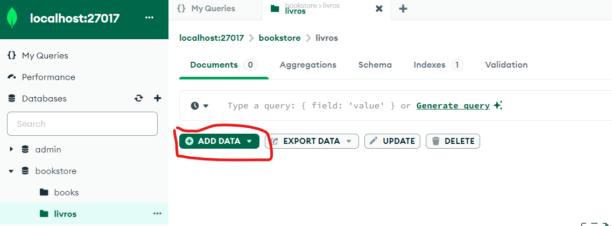
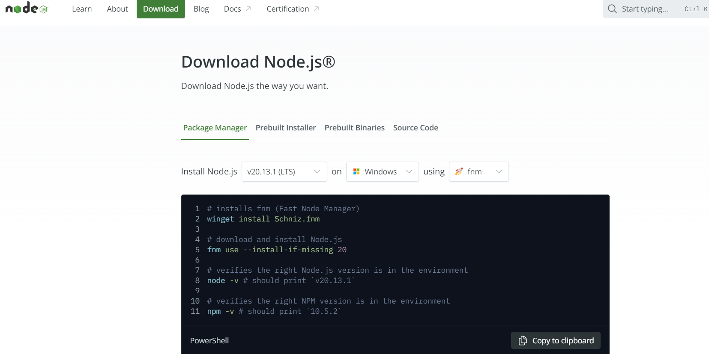

<h1>Exercício Paginacao de Livros</h1>

Para ser acessado pelo usuário pela primeira vez

=======

Para ser acessado pelo(a) usuário(a) pela primeira vez

 
 

Instale o Mongo DB

<a href="https://www.mongodb.com/try/download/community">Link Site</a>

 
 

Adicione os dados do CSV arquivo

Certifique-se de estar rodando na mesma porta para o arquivo db.js (Ex: localhost:27017)

 
 

Instale o Node, conforme código para a plataforma escolhida

<a href="https://nodejs.org/en/download/package-manager">Link Download</a>

É importante clicar na segunda aba da figura acima para entrar no link que direciona para a instalação do Node

 
 

Instale os pacotes requeridos

Abra o terminal na mesma pasta do projeto e execute o comando:

<b>
npm install
</b>

 
 

Basta executar o projeto com o terminal aberto na mesma pasta do projeto execute o comando:

<b>
node .\server.js
</b>
 
 

Poderá ser acessado no navegador na porta executando no momento como 3000 exemplo (localhost:3000)

<b>
Server running on port 3000
</b>

 
 
<b>
FIM
</b>

